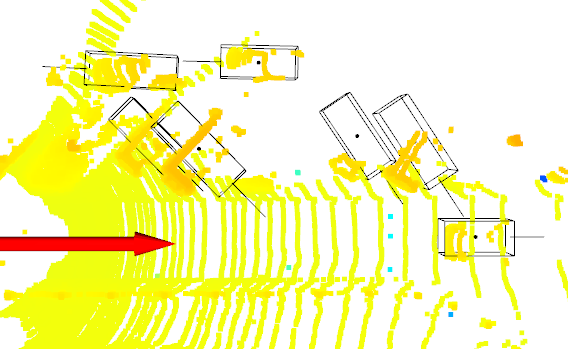

# Some comments on original code

Eventually the Label3D needs a negation in the yaw. In case such yaw negation is **not introduced** the labels are not matching the point cloud, which is especially well seen when yaw is ~45/135 degrees:<br>

<br>
This would also need to remove the negation in the output bounding boxes in inference_utils.py:
<pre>
either
bb_yaw = np.arcsin(np.clip(ang[value], -1, 1)) + real_anchors[i][4]
or
bb_yaw = np.arcsin(np.clip(ang[value], -1, 1)) - real_anchors[i][4]
</pre>
# About Point Pillars
Point Pillars is a very famous Deep Neural Network for 3D Object Detection for LiDAR point clouds. With the application of object detection on the LiDAR devices fitted in the self driving cars, Point Pillars focuse on fast inference ~50fps, which was magnitudes above as compared to other networks for 3D Object detection. In this repo, we are trying to develop point pillars in TensorFlow. [Here's](https://medium.com/@a_tyagi/pointpillars-3d-point-clouds-bounding-box-detection-and-tracking-pointnet-pointnet-lasernet-67e26116de5a?source=friends_link&sk=4a27f55f2cea645af39f72117984fd22) a good first post to familiarize yourself with Point Pillars. 

**Contributors are welcome to work on open issues and submit PRs. First time contributors are welcome and can pick up any "Good First Issues" to work on.**

# PointPillars in TensorFlow
Point PIllars 3D detection network implementation in Tensorflow. External contributions are welcome, please fork this repo and see the issues for possible improvements in the code.  

# Installation
Download the LiDAR, Calibration and Label_2 **zip** files from the [Kitti dataset link](http://www.cvlibs.net/datasets/kitti/eval_object.php?obj_benchmark=3d) and unzip the files, giving the following directory structure:

```plain
├── training    <-- 7481 train data
   |   ├── calib
   |   ├── label_2
   |   ├── velodyne
└── testing     <-- 7580 test data
           ├── calib
           ├── velodyne
```
After placing the Kitti dataset in the root directory, run the following code

```
git clone --recurse-submodules https://github.com/tyagi-iiitv/PointPillars.git
virtualenv --python=/usr/bin/python3.8 env
source ./env/bin/activate
pip install tensorflow-gpu tensorflow_probability sklearn opencv-python
cd PointPillars
python setup.py install
python point_pillars_training_run.py
```

# Deploy on a cloud notebook instance (Amazon SageMaker etc.)
Please read this blog article: https://link.medium.com/TVNzx03En8

# Technical details about this code
Please refer to this [article](https://medium.com/@a_tyagi/implementing-point-pillars-in-tensorflow-c38d10e9286?source=friends_link&sk=90995fae2d0a9c4e0dd5ec420c218c84) on Medium. 

# Pretrained Model
The Pretrained Point Pillars for Kitti with complete training and validation logs can be accessed with this [link](https://drive.google.com/file/d/1VfnYr3N7gZb2RuzQNCTrTIZoaoLEzc8O/view?usp=sharing). Use the file model.h5.

# Saving the model as .pb
Inside the point_pillars_training_run.py file, change the code as follows to save the model in .pb format. 

```
import sys
if __name__ == "__main__":

    params = Parameters()

    pillar_net = build_point_pillar_graph(params)
    pillar_net.load_weights(os.path.join(MODEL_ROOT, "model.h5"))
    pillar_net.save('new_model')
    sys.exit()
    # This saves the model as pb in the new_model directory. 
    # Remove these lines during usual training. 
```
# Loading the saved pb model
```
model = tf.saved_model.load('model_directory')
```

